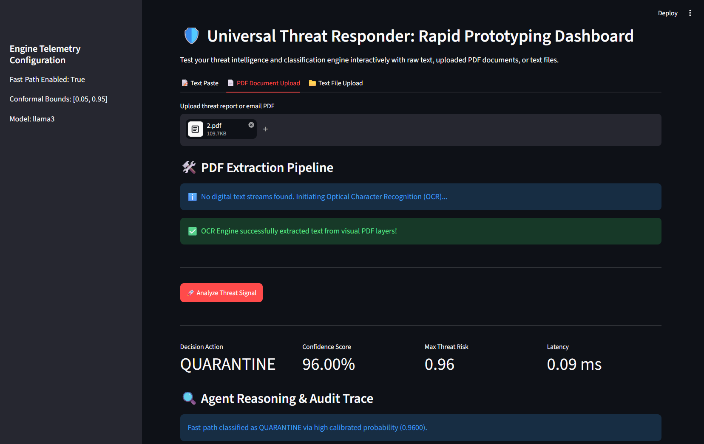
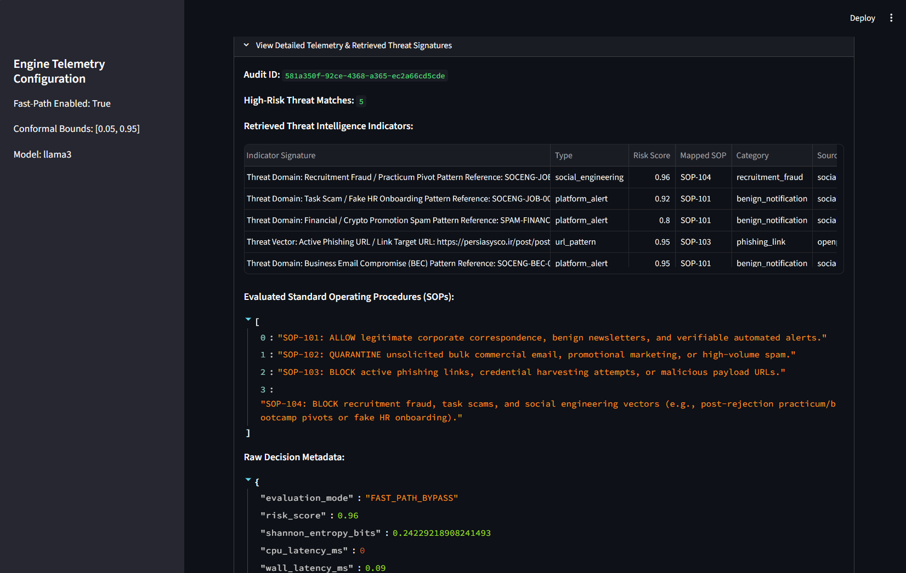

# 🛡️ Universal Threat Responder

### Uncertainty-aware threat triage with RAG, local LLMs, conformal routing, and live threat intelligence

[](https://www.python.org/)
[](https://www.langchain.com/langgraph)
[](https://ollama.com/)
[](https://milvus.io/)
[](https://streamlit.io/)

**Universal Threat Responder** is a research-oriented threat triage and decision engine combining **machine learning, retrieval-augmented generation, local LLM reasoning, conformal risk routing, and live threat intelligence**.

The system accepts heterogeneous threat signals, normalizes them into a common representation, retrieves relevant threat intelligence from a Milvus vector database, and processes the enriched signal through a stateful LangGraph decision workflow.

It supports both:

- **high-confidence fast-path decisions**, and
- **full RAG + LLM escalation** for samples requiring deeper contextual reasoning.

The project also includes an evaluation pipeline for measuring **classification performance, uncertainty, retrieval similarity, calibration, and routing behaviour**.

---

# 🔭 What This Project Demonstrates

The project focuses on the engineering problem of combining **classical ML, retrieval, local LLM reasoning, uncertainty estimation, and operational routing** into one measurable workflow.

The main technical components are:

```text
Machine Learning
    │
    ├── Classification
    ├── Uncertainty estimation
    └── Conformal routing
             │
             ▼
Retrieval
    │
    └── Milvus + embeddings
             │
             ▼
LLM Engineering
    │
    ├── Local inference
    ├── LangGraph
    └── Grounded reasoning
             │
             ▼
Security Engineering
    │
    ├── Threat intelligence
    ├── Document/OCR processing
    └── Audit telemetry
             │
             ▼
Evaluation
    │
    ├── Classification metrics
    ├── Calibration
    ├── Retrieval diagnostics
    └── Routing metrics
```

---

## ✨ Key Features

| Feature                         | Description                                                                    | Technology                           |
| :------------------------------ | :----------------------------------------------------------------------------- | :----------------------------------- |
| **Agentic Threat Triage**       | Stateful threat-analysis workflow producing structured decisions               | LangGraph                            |
| **Local LLM Reasoning**         | Runs the reasoning layer locally without requiring a hosted LLM API            | Ollama / Llama 3                     |
| **Milvus RAG**                  | Retrieves relevant threat indicators, historical patterns, and SOP context     | Milvus + BGE embeddings              |
| **Conformal Fast Path**         | Bypasses the expensive LLM path for sufficiently confident predictions         | Conformal risk routing               |
| **Live Threat Intelligence**    | Synchronizes current phishing and malicious-URL intelligence before evaluation | OpenPhish, Abuse.ch URLhaus          |
| **PDF & OCR Processing**        | Extracts text from native and scanned PDF documents                            | PyMuPDF, pdfplumber, pypdf, RapidOCR |
| **Domain Adapter Architecture** | Separates domain-specific data loading from the core decision graph            | `DomainAdapter`                      |
| **Zero-Leakage Evaluation**     | Uses grouped stratification to reduce template memorization                    | StratifiedGroupKFold                 |
| **Telemetry & Audit Logging**   | Records prediction, uncertainty, retrieval, routing, and operational metrics   | CSV / logs                           |
| **Interactive Dashboard**       | Allows interactive analysis of text, files, and PDFs                           | Streamlit                            |

---

# 🏗️ System Architecture

```text
                         ┌──────────────────────────────┐
                         │   Live Threat Intelligence   │
                         │                              │
                         │ OpenPhish / Abuse.ch URLhaus│
                         └──────────────┬───────────────┘
                                        │
                                        ▼
┌──────────────────────┐       ┌────────────────────────┐
│ Raw Threat Input     │       │      Milvus RAG        │
│                      │       │                        │
│ • Text               │       │ • Threat indicators   │
│ • Text files         │       │ • Historical patterns  │
│ • PDF documents      │       │ • SOP context          │
└──────────┬───────────┘       └────────────┬───────────┘
           │                                │
           ▼                                │
┌──────────────────────┐                    │
│ Document Extraction  │                    │
│                      │                    │
│ PyMuPDF              │                    │
│ pdfplumber           │                    │
│ pypdf                │                    │
│ RapidOCR             │                    │
└──────────┬───────────┘                    │
           │                                │
           └──────────────┬─────────────────┘
                          ▼
                 ┌──────────────────┐
                 │   ThreatSignal   │
                 │ Normalized input │
                 └────────┬─────────┘
                          │
                          ▼
                 ┌──────────────────┐
                 │ Conformal Router │
                 └───────┬─────┬────┘
                         │     │
                confident│     │uncertain
                         │     │
                         ▼     ▼
                    ┌──────┐ ┌──────────────┐
                    │Fast  │ │  Milvus RAG  │
                    │Path  │ │  Retrieval   │
                    └──┬───┘ └──────┬───────┘
                       │             │
                       │             ▼
                       │      ┌──────────────┐
                       │      │  Local LLM   │
                       │      │  Ollama      │
                       │      └──────┬───────┘
                       │             │
                       └──────┬──────┘
                              ▼
                    ┌────────────────────┐
                    │ ThreatResponderGraph│
                    │      LangGraph      │
                    └─────────┬──────────┘
                              │
                              ▼
                    ┌────────────────────┐
                    │   DecisionOutput    │
                    │                    │
                    │ BLOCK / ALLOW /    │
                    │ FLAG               │
                    └─────────┬──────────┘
                              │
                    ┌─────────┴─────────┐
                    ▼                   ▼
             ┌──────────────┐    ┌───────────────┐
             │ Audit Logs   │    │ Evaluation    │
             │              │    │ Telemetry     │
             └──────────────┘    └───────────────┘
```

The current implementation normalizes inputs into a `ThreatSignal`, enriches them through the RAG layer, processes them with `ThreatResponderGraph`, and records the resulting decision and evaluation telemetry.

---

## Project Structure

```text
universal-threat-responder/
├── adapters/
│   ├── phishfuzzer_loader.py            # Zero-leakage dataset loader & TF-IDF vectorization
│   └── rag_spam_adapter.py              # Milvus Vector RAG Adapter
├── data/
│   ├── milvus_threat_intel.db           # Persistent Milvus vector database
│   └── spam/                            # Evaluation benchmark datasets
├── evals/
│   ├── run_evals.py                     # Main evaluation runner with threat-intel sync
│   └── threat_evaluator.py              # Uncertainty & evaluation metrics
├── scripts/
│   ├── ingest_threat_intel.py           # Threat intelligence ingestion
│   ├── seed_threat_intel.py             # Seeds threat signatures and SOPs
│   └── populate_phishing_vectorstore.py # Indexes threat patterns into Milvus
├── src/
│   ├── core.py                          # ThreatResponderGraph & SecurityTools
│   └── domain_interface.py              # ThreatSignal, DecisionOutput, DomainAdapter
├── app.py                               # Interactive Streamlit dashboard
├── config.py                            # Configuration & conformal bounds
├── requirements.txt                     # Dependencies
└── README.md                            # Project documentation
```

---

## Interactive Dashboard & Execution Example

The Streamlit prototyping dashboard (`app.py`) allows you to analyze threat signals interactively using raw text, text files, or uploaded PDF documents.

### Dashboard UI Preview

<p align="center">
  
  
</p>

### Sample PDF Triage Execution

When processing an uploaded threat report or email PDF (`2.pdf`), the multi-engine parser and OCR pipeline execute sequentially:

- **OCR Extraction Pipeline**: If no digital text streams are found, the engine initiates optical character recognition.
- **Decision Action**: **QUARANTINE**
- **Confidence & Max Risk Score**: `0.96`
- **Execution Latency**: `0.07 ms`

---

## Benchmark & Telemetry Results

The latest evaluation was run on **3,960 samples** from:

`data/spam/PhishFuzzer_emails_entity_rephrased_v1.json`

Threat intelligence was synchronized before evaluation, including **30 OpenPhish records**, **30 Abuse.ch URLhaus records**, and **65 email threat records**.

### Performance Summary

| Metric                         | Fast-Path Enabled | Fast-Path Disabled |
| :----------------------------- | :---------------: | :----------------: |
| **Samples**                    |     **3,960**     |     **3,960**      |
| **Fast-Path Bypass**           |    **41.44%**     |     **0.00%**      |
| **Accuracy**                   |    **86.44%**     |     **82.37%**     |
| **Macro Precision**            |    **85.90%**     |     **81.29%**     |
| **Macro Recall**               |    **85.73%**     |     **79.69%**     |
| **Macro F1**                   |     **0.845**     |     **0.778**      |
| **Quarantined Rate**           |    **34.62%**     |     **46.44%**     |
| **Mean ML Entropy**            |    0.4310 bits    |    0.4310 bits     |
| **Mean RAG Top-1 Similarity**  |      0.2164       |       0.2228       |
| **Mean LLM Calibration Error** |      0.0449       |       0.0476       |

### Live Telemetry

| Metric                              |  Latest Value  |
| :---------------------------------- | :------------: |
| **High-Risk Threat Indicator Hits** |   **13,448**   |
| **OpenPhish Records**               |     **30**     |
| **URLhaus Records**                 |     **30**     |
| **Email Threat Records**            |     **65**     |
| **Conformal Bounds**                | `[0.05, 0.95]` |

> The fast-path and full-path results use the same 3,960-sample dataset. This is an observational configuration comparison rather than a controlled causal experiment, since enabling fast-path routing changes which samples reach the LLM/RAG pipeline.

### Data Provenance

- **[PhishFuzzer Dataset](https://github.com/DataPhish/PhishFuzzer)** — phishing, spam, and legitimate enterprise email samples.
- **[OpenPhish](https://openphish.com/)** — live phishing intelligence.
- **[Abuse.ch URLhaus](https://urlhaus.abuse.ch/)** — malicious URL and malware-distribution intelligence.
- Behavioral threat patterns and SOP-based indicators are also used for retrieval and enrichment.

---

# 🗺️ Roadmap

### Evaluation

- [ ] Formalize reproducible dependency versions
- [ ] Add automated CI regression evaluation
- [ ] Expand ablation studies
- [ ] Further calibrate conformal thresholds
- [ ] Evaluate routing quality independently from classification quality

### Retrieval

- [ ] Add sender-domain telemetry
- [ ] Add SPF/DKIM signals
- [ ] Add URL link-entropy features
- [ ] Expand the SOP knowledge base

### Security domains

- [ ] Network intrusion / SIEM adapter
- [ ] NetFlow analysis adapter
- [ ] Transaction-fraud adapter
- [ ] MITRE ATT&CK mapping

### Human oversight

- [ ] Uncertainty-based analyst escalation
- [ ] Human-in-the-loop review queue
- [ ] Analyst feedback collection
- [ ] Review and override telemetry

---

## Setup & Quickstart

### Prerequisites

- Python 3.10+
- [Ollama](https://ollama.com/) running locally
- Llama 3

```bash
ollama pull llama3.2
```

### Clone & Set Up Environment

```bash
git clone https://github.com/Aylin1/universal-threat-responder.git
cd universal-threat-responder

# Linux / macOS / Git Bash
python3 -m venv .venv
source .venv/bin/activate

# Windows PowerShell
python -m venv .venv
.\.venv\Scripts\Activate.ps1
```

### Install Dependencies

```bash
pip install -r requirements.txt
```

### 1. Run Evaluation — Fast-Path Enabled

```bash
python -m evals.run_evals
```

### 2. Run Evaluation — Full LLM/RAG Path

```bash
python -m evals.run_evals --disable-fast-path
```

Both commands evaluate the PhishFuzzer dataset and write the resulting audit metrics to:

```text
evals/live_audit_report_results.csv
```

### 3. Launch the Interactive Dashboard

```bash
streamlit run app.py
```

---

## Notes

This project is a **research/engineering prototype** for experimenting with retrieval-grounded threat triage, conformal routing, local LLMs, and auditable security workflows. Benchmark results are dataset- and configuration-specific and should not be interpreted as production security performance.
