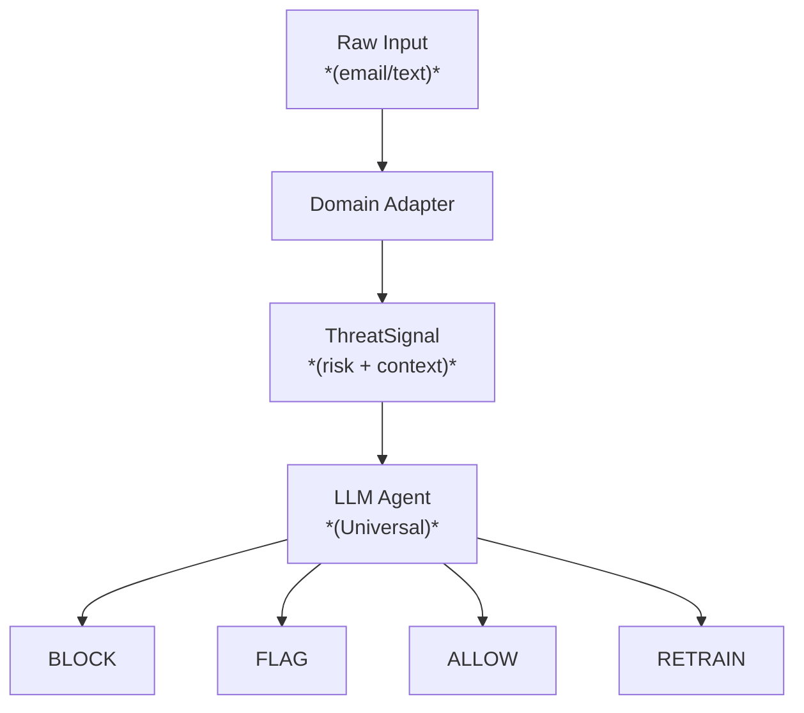

# Universal Threat Responder

**Agentic AI decision engine** for autonomous security responses.  
Works across any classification domain by plugging in domain adapters.

## Why Universal?

Most ML systems are hardcoded for one task (spam, fraud, etc.). This architecture:

- **Separates concerns**: Core agent logic ≠ domain logic
- **Swappable adapters**: Add new domains in ~50 lines per adapter
- **Same decisions**: Block/Flag/Allow/Retrain actions remain consistent
- **Single audit trail**: All decisions logged regardless of domain

## Architecture Overview

---

## Stage Breakdown

### 1. Ingestion & Transformation

- **Raw Input:** Captures incoming unstructured data streams (e.g., emails, text messages, payload submissions).
- **Domain Adapter:** Sanitizes, normalizes, and adapts raw inputs into structured domain-specific schemas.

### 2. Threat Analysis

- **ThreatSignal:** Computes quantitative risk scores and extracts contextual metadata required for downstream policy enforcement.

### 3. Decision Engine

- **Universal LLM Agent:** Evaluates the generated threat signal against system instructions and organizational policies to determine the appropriate response.

### 4. Action Outcomes

The pipeline routes each evaluated input into one of four distinct decision states:

- 🛑 **BLOCK:** Immediately drops the input and triggers defensive safeguards.
- ⚠️ **FLAG:** Allows processing with warnings or routes the item for human review.
- ✅ **ALLOW:** Passes the input safely through the pipeline.
- 🔄 **RETRAIN:** Captures the input to update and improve downstream model weights or threat filters.

---

## Included Adapters

| Adapter       | Domain               | Input Format   | Status         |
| ------------- | -------------------- | -------------- | -------------- |
| `SpamAdapter` | Email spam filtering | Raw email text | not tested yet |
